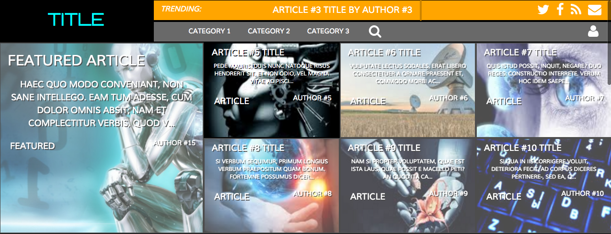

#Creating a resposive Bootstrap Landing Page.

*Content Routed through AngularJS binding.
*Custom Jquery for hover drop down menues,
position of elements on scroll,
and for carousel logic.
*Styled through SASS and piped through a custom Gulpfile.

*Based upon layout of Singularityhub.com

#GULPFILE USES:

* Gulp
* Browser-Sync
* Gulp-Clean-Css
* Gulp-Ruby-Sass
* Gulp-Stylus
* Gulp-Less
* Path
* Jshint-Stylish
* Gulp-Jshint
* Jshint
* Gulp-Uglify
* Gulp-Rename
* Gulp-Concat
* Gulp-Imagemin
* Bootstrap
